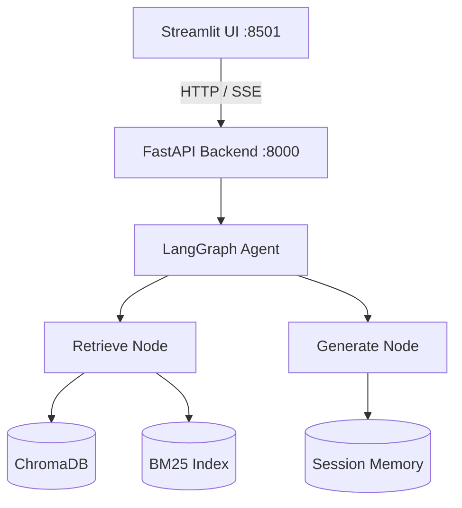

# K8s RAG Chatbot

A production-style RAG system for Kubernetes documentation. Built with LangGraph, ChromaDB, and FastAPI. Hybrid retrieval (vector + BM25), streaming responses over SSE, and operational killswitches for graceful degradation.

[](https://github.com/genadyarony-code/k8s-rag-chatbot/actions/workflows/ci.yml)
[](https://www.python.org/downloads/)
[](https://opensource.org/licenses/MIT)


---

## What it does

Ask a question about Kubernetes — for example, *"Why is my Pod stuck in Pending state?"* — and the system retrieves relevant chunks from the indexed corpus, generates a grounded answer with `gpt-4o-mini`, and streams the response token-by-token. Last 3 conversation turns are kept in session memory.

## Knowledge base

Three sources, chosen to cover distinct user intents:

| Document | Type | Intent | Chunks |
|----------|------|--------|--------|
| [kubernetes.io/docs/concepts](https://kubernetes.io/docs/concepts/) | HTML | "Explain what X is" | ~2,400 |
| Kubernetes in Action 2nd Ed (Ch 1–10) | PDF | "How do I do X" | ~1,200 |
| [learnk8s.io/troubleshooting](https://learnk8s.io/troubleshooting-deployments) | HTML | "Why isn't X working" | ~38 |

The troubleshooting doc is ~1% of the corpus but accounts for ~30% of queries. Without explicit query routing, vector search would consistently miss it in favor of the larger corpora.

## Architecture



Each layer has one responsibility and no upward dependencies. Full architecture documentation is in [PROJECT_MAP.md](PROJECT_MAP.md).

## Quick start

### Prerequisites
- Python 3.12+
- Docker + Docker Compose
- OpenAI API key

### Setup

```bash
git clone https://github.com/genadyarony-code/k8s-rag-chatbot.git
cd k8s-rag-chatbot
cp .env.example .env

# Add your OpenAI API key to .env
echo "OPENAI_API_KEY=sk-your-key-here" >> .env

# Place source documents in data/raw/:
#   - k8s_concepts.html (scraped from kubernetes.io)
#   - k8s_in_action_ch1-10.pdf (Kubernetes in Action 2nd Ed)
#   - k8s_troubleshooting.html (learnk8s.io)

# Build indexes (one-time, ~2 minutes)
pip install -r requirements.txt
python scripts/ingest.py

# Start services
docker compose up --build
```

- UI: http://localhost:8501
- API: http://localhost:8000/docs

## Tech stack

| Component | Choice | Rationale |
|-----------|--------|-----------|
| Embeddings | `text-embedding-3-small` | Cheap and high quality on technical text |
| Vector DB | ChromaDB | Local-first, persistent, no separate service |
| Keyword search | BM25 (`rank_bm25`) | Zero infrastructure, good for exact-match queries (`CrashLoopBackOff`) |
| PDF parsing | Docling → PyMuPDF + pdfplumber | Docling preserves YAML indentation; falls back loudly on failure |
| LLM | `gpt-4o-mini` | Sufficient for grounded RAG, $0.15 per 1M input tokens |
| Orchestration | LangGraph | Explicit graph, built-in checkpointer |
| Backend | FastAPI | Native async, SSE, Pydantic validation |
| Frontend | Streamlit | Sufficient for a technical demo |
| Memory | In-process dict | Demo scope; Redis is the production replacement |

## Notable design choices

### Query routing for corpus imbalance

Vector search alone almost never returns troubleshooting chunks because the troubleshooting corpus is dwarfed by concepts and the book. A small regex classifier runs before retrieval — if the query matches troubleshooting signals, retrieval is forced into the troubleshooting subset, with a fallback to the full corpus if nothing matches.

```python
patterns = [
    r'\b(crash|crashloop|pending|failed|error|not\s+working)\b',
    r'\b(why|debug|troubleshoot|diagnose)\b',
    r'\bpod\s+(is|isn.t|won.t)\b',
    # ...
]

if any(re.search(p, query, re.I) for p in patterns):
    results = chroma.query(query, where={"doc_type": "troubleshooting"})
    if not results:
        results = chroma.query(query)
```

An LLM classifier would double the cost of every request. Regex covers the common cases at zero latency.

### Loud degradation on PDF parsing

```python
try:
    chunks = docling_loader.load(pdf_path)
except Exception as e:
    print_fallback_warning(pdf_path, error=e)
    chunks = hybrid_pdf_loader.load(pdf_path)
```

```
╔══════════════════════════════════════════════════════╗
║  ⚠  DOCLING FALLBACK TRIGGERED                       ║
║  File   : k8s_in_action_ch1-10.pdf                  ║
║  Reason : Module 'docling' not found                 ║
║  Action : Falling back to PyMuPDF + pdfplumber       ║
║  Impact : YAML indentation & tables may be degraded  ║
╚══════════════════════════════════════════════════════╝
```

Silent fallback hides quality regressions. The banner makes degradation visible at ingestion time.

### Feature flags as mitigation switches

| Flag | Default | Fallback behavior |
|------|---------|-------------------|
| `FF_USE_CHROMA` | `true` | BM25 keyword search only |
| `FF_USE_OPENAI` | `true` | Return raw chunks, no LLM generation |
| `FF_USE_SESSION_MEMORY` | `true` | Stateless mode |
| `FF_USE_STREAMING` | `true` | Batch response instead of SSE |

If OpenAI is down, flipping `FF_USE_OPENAI=false` and restarting returns raw retrieved chunks instead of failing the request — degraded service rather than 500 errors.

### Index sync via manifest

`ingest.py` writes `data/processed/index_meta.json` after successful indexing:

```json
{
  "timestamp": "2026-03-22T10:15:30Z",
  "chroma_ok": true,
  "bm25_ok": true,
  "chunk_schema_version": "v1.0",
  "num_chunks": 3642
}
```

FastAPI checks this in its `lifespan` startup hook and refuses to start if either index is missing or marked failed. A loud failure on startup is preferable to a silently broken API.

## Operational features

**Health endpoint and sidebar.** The Streamlit sidebar surfaces ChromaDB status, BM25 status, and current feature-flag values, so it's clear at a glance which subsystem is degraded.

**Cost monitoring.** Every LLM call logs token counts and approximate cost via `tiktoken` + `logging`. No Prometheus dependency at this scale.

```
[INFO] LLM call | Prompt: 1,245 tokens | Completion: 387 tokens | Cost: $0.0024
```

## Testing

```bash
# Unit tests
pytest tests/ -v

# RAG quality evaluation
python tests/eval/run_eval.py
```

The evaluation set scores keyword coverage in answers and source-type relevance in retrieval. Confidently wrong answers are worse than "I don't know," so the eval treats both as failures.

## Project structure

```
k8s-rag-chatbot/
├── data/
│   ├── raw/                    Source documents (gitignored)
│   └── processed/
│       ├── chunks.json         Preprocessed chunks
│       └── index_meta.json     Index sync manifest
├── src/
│   ├── config/                 Settings + feature flags
│   ├── ingestion/              Loaders → preprocessor → indexer
│   ├── agent/                  LangGraph graph + nodes + memory + prompts
│   ├── api/                    FastAPI backend
│   └── ui/                     Streamlit frontend
├── tests/
│   ├── test_*.py               Unit tests
│   └── eval/                   RAG quality evaluation
├── scripts/
│   └── ingest.py               One-time ingestion CLI
├── PROJECT_MAP.md              Full architecture documentation
├── docker-compose.yml
└── requirements.txt
```

## What's not here

| Feature | Why not | Production path |
|---------|---------|-----------------|
| Re-ranking | Adds latency, overkill for a 3-doc corpus | Add `flashrank` after top-5 retrieval |
| Redis session store | API runs `--workers 1` because session memory is in-process | Replace `SessionMemory` with `redis.Redis` to scale horizontally |
| Semantic chunking | LLM-based: cost + slowness | Worth it once the corpus passes ~10 docs |
| Authentication | Out of scope | FastAPI OAuth2 middleware |
| Monitoring | Logging is sufficient at this scale | Prometheus + Grafana |

## Contributing

See [CONTRIBUTING.md](CONTRIBUTING.md). PRs welcome.

## License

MIT — see [LICENSE](LICENSE).

## Author

**Yaron Genad** — [Medium](https://medium.com/@yaron.genad) · [LinkedIn](https://linkedin.com/in/yaron-genad) · genad.yaron.y@gmail.com

## Acknowledgments

- [LangGraph](https://github.com/langchain-ai/langgraph) by LangChain
- Kubernetes documentation from [kubernetes.io](https://kubernetes.io)
- *Kubernetes in Action, 2nd Edition* by Marko Lukša
- Troubleshooting guide from [learnk8s.io](https://learnk8s.io)
