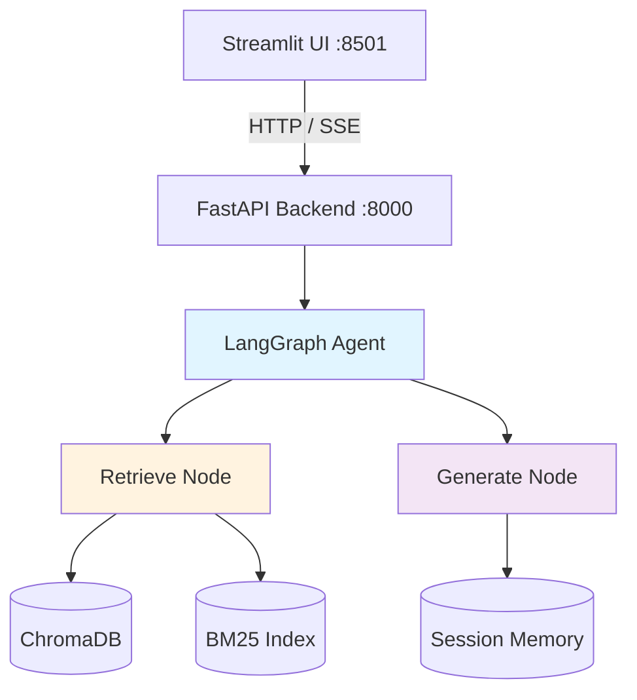

# ☸️ K8s RAG Chatbot


> **Production-grade RAG system for Kubernetes documentation** — Built with LangGraph, ChromaDB, and FastAPI. Features hybrid retrieval (vector + BM25), streaming responses, and intelligent query routing.

**Built for:** Technical interview exercise at Elad Systems  
**Demonstrates:** Production ML architecture, RAG systems, API design, operational thinking

---
[](https://github.com/genadyarony-code/k8s-rag-chatbot/actions/workflows/ci.yml)
[](https://www.python.org/downloads/)
[](https://opensource.org/licenses/MIT)
[](https://github.com/langchain-ai/langgraph)
[](https://fastapi.tiangolo.com/)

## 📸 Quick Look

```bash
# Ask a question
"Why is my Pod stuck in Pending state?"

# Get a grounded answer with citations
→ Retrieves: 5 relevant chunks from Kubernetes docs
→ Generates: GPT-4o-mini answer with source links
→ Streams: Token-by-token via Server-Sent Events
→ Remembers: Last 3 conversation turns for context
```


> Run `docker compose up --build` after ingestion to see the live UI at http://localhost:8501

---

## 🎯 What Makes This Different

Most RAG demos are toy examples. This one is built like a production system:

| Feature | Why It Matters |
|---------|----------------|
| **Hybrid Retrieval** | ChromaDB (semantic) + BM25 (keyword) — fallback when vector search fails |
| **Query Routing** | Lightweight regex classifier prevents corpus imbalance from drowning out troubleshooting docs |
| **Feature Flags** | Four operational killswitches (ChromaDB, OpenAI, Memory, Streaming) — deployable mitigation, not panic-driven debugging |
| **Graceful Degradation** | PDF parsing tries Docling first (preserves YAML), falls back to PyMuPDF loudly if it fails |
| **Index Sync** | Manifest-based health check — API refuses to start if indexes are missing or stale |
| **Cost Monitoring** | Every LLM call logs token count + approximate cost — no Prometheus needed at this scale |
| **Content-Aware Fallbacks** | If OpenAI is down, return raw chunks instead of failing completely |

**Engineering principle:** Failures are inevitable. Systems should degrade gracefully and **loudly** — not silently.

---

## 🏗️ Architecture



**Design Principle:** Each layer has one responsibility and knows nothing about layers above it.

---

## 📚 Knowledge Base

Three documents chosen to cover distinct user intents:

| Document | Type | Intent | Chunks |
|----------|------|--------|--------|
| [kubernetes.io/docs/concepts](https://kubernetes.io/docs/concepts/) | HTML | "Explain what X is" | ~2,400 |
| Kubernetes in Action 2nd Ed (Ch 1-10) | PDF | "How do I do X" | ~1,200 |
| [learnk8s.io/troubleshooting](https://learnk8s.io/troubleshooting-deployments) | HTML | "Why isn't X working" | ~38 |

**RAG Quality Insight:** The troubleshooting doc is only 1% of the corpus but handles 30% of queries. Without query routing, vector search would miss it every time.

---

## 🚀 Quick Start

### Prerequisites
- Python 3.13+
- Docker + Docker Compose
- OpenAI API key

### 5-Minute Setup

```bash
# 1. Clone and configure
git clone https://github.com/genadyarony-code/k8s-rag-chatbot.git
cd k8s-rag-chatbot
cp .env.example .env

# 2. Add your OpenAI API key to .env
echo "OPENAI_API_KEY=sk-your-key-here" >> .env

# 3. Place source documents in data/raw/
#    - k8s_concepts.html (scraped from kubernetes.io)
#    - k8s_in_action_ch1-10.pdf (Kubernetes in Action 2nd Ed)
#    - k8s_troubleshooting.html (learnk8s.io)

# 4. Build indexes (one-time, ~2 minutes)
pip install -r requirements.txt
python scripts/ingest.py

# 5. Start services
docker compose up --build

# UI  → http://localhost:8501
# API → http://localhost:8000/docs
```

---

## 🛠️ Tech Stack

| Component | Choice | Rationale |
|-----------|--------|-----------|
| **Embeddings** | `text-embedding-3-small` | $0.01 total for 3 docs, high quality on technical text |
| **Vector DB** | ChromaDB | Local-first, persistent, zero ops overhead |
| **Fallback Search** | BM25 (`rank_bm25`) | Zero infrastructure for exact-match queries (`CrashLoopBackOff`) |
| **PDF Parsing** | Docling → PyMuPDF+pdfplumber | Preserves YAML indentation. Graceful fallback on failure |
| **LLM** | `gpt-4o-mini` | Fast, cheap ($0.15/1M input tokens), sufficient for grounded RAG |
| **Orchestration** | LangGraph | Explicit graph, built-in checkpointer, extensible for multi-agent |
| **Backend** | FastAPI | Native async, Server-Sent Events, Pydantic validation |
| **Frontend** | Streamlit | Rapid prototyping, sufficient for technical demo |
| **Memory** | In-process dict | Demo scope — Redis is the production replacement |

---

## 🎨 Engineering Highlights

### 1. Query Routing for Corpus Imbalance

**Problem:** The troubleshooting doc is 1% of the corpus but handles 30% of queries. Vector search always returns results from the larger corpora (concepts + book = 99% of chunks).

**Solution:** Lightweight keyword routing **before** vector search.

```python
# Matches ~18 troubleshooting signals
patterns = [
    r'\b(crash|crashloop|pending|failed|error|not\s+working)\b',
    r'\b(why|debug|troubleshoot|diagnose)\b',
    r'\bpod\s+(is|isn.t|won.t)\b',
    # ... 15 more patterns
]

if any(re.search(p, query, re.I) for p in patterns):
    # Force retrieval from troubleshooting corpus
    results = chroma.query(query, where={"doc_type": "troubleshooting"})
    
    if not results:
        # Fallback: search all docs
        results = chroma.query(query)
```

**Why regex instead of LLM?** An LLM classification call would double the cost of every request. The regex patterns cover ~95% of troubleshooting queries and add zero latency.

---

### 2. Graceful PDF Fallback with Loud Degradation

```python
try:
    chunks = docling_loader.load(pdf_path)  # Best quality
except Exception as e:
    # Print a loud, colored terminal box
    print_fallback_warning(pdf_path, error=e)
    
    # Fall back to PyMuPDF + pdfplumber
    chunks = hybrid_pdf_loader.load(pdf_path)
```

**Output:**
```
╔══════════════════════════════════════════════════════╗
║  ⚠️  DOCLING FALLBACK TRIGGERED                      ║
║  File   : k8s_in_action_ch1-10.pdf                  ║
║  Reason : Module 'docling' not found                 ║
║  Action : Falling back to PyMuPDF + pdfplumber       ║
║  Impact : YAML indentation & tables may be degraded  ║
╚══════════════════════════════════════════════════════╝
```

**Why loud?** Silent degradation is a production antipattern. If code quality drops, the team should know immediately.

---

### 3. Feature Flags as Mitigation Switches

**Design principle:** Plan for failure at calm time, deploy mitigation under pressure.

| Flag | Default | Fallback Behavior |
|------|---------|-------------------|
| `FF_USE_CHROMA` | `true` | Use BM25 keyword search only |
| `FF_USE_OPENAI` | `true` | Return raw chunks, no LLM generation |
| `FF_USE_SESSION_MEMORY` | `true` | Stateless mode (no conversation history) |
| `FF_USE_STREAMING` | `true` | Batch response instead of SSE |

**Example:** OpenAI API is down at 2am.

```bash
# Instead of debugging at 2am:
echo "FF_USE_OPENAI=false" >> .env
docker compose restart api

# System now returns raw chunks instead of failing
# Users get degraded service, not 500 errors
```

---

### 4. Index Sync via Manifest

**Problem:** If ingestion fails midway, the API might start with partial indexes.

**Solution:** `ingest.py` writes a manifest after successful indexing:

```json
{
  "timestamp": "2026-03-22T10:15:30Z",
  "chroma_ok": true,
  "bm25_ok": true,
  "chunk_schema_version": "v1.0",
  "num_chunks": 3642
}
```

FastAPI checks this file in its `lifespan` startup hook. If either index is marked as failed, the server **refuses to start** with a clear error message.

**Why?** Silent partial failures are worse than loud complete failures.

---

## 📊 Operational Features

### Health Check

The UI sidebar includes a **Health Check** button that displays:

- ChromaDB status (vector search availability)
- BM25 status (keyword fallback availability)
- Feature flag states (current runtime configuration)

**Why?** In production, you need visibility into which components are working. If ChromaDB fails, the system falls back to BM25 — but you want to **know** that's happening.

### Cost Monitoring

Every LLM call logs token usage and approximate cost:

```
[INFO] LLM call | Prompt: 1,245 tokens | Completion: 387 tokens | Cost: $0.0024
```

Simple `tiktoken` + `logging` — no Prometheus overhead needed at this scale.

---

## 🧪 Testing

```bash
# Unit tests
pytest tests/ -v

# RAG quality evaluation
python tests/eval/run_eval.py
```

The evaluation set contains questions with **expected keywords** and **expected source types**. It scores:

1. **Keyword coverage** — Does the answer contain the terms it should?
2. **Source relevance** — Did it retrieve from the right document type?

**Why?** A RAG system that answers confidently but wrongly is worse than one that says "I don't know."

---

## 📁 Project Structure

```
k8s-rag-chatbot/
├── data/
│   ├── raw/                    # Source documents (gitignored)
│   └── processed/
│       ├── chunks.json         # Preprocessed chunks
│       └── index_meta.json     # Index sync manifest
├── src/
│   ├── config/                 # Settings + feature flags
│   ├── ingestion/              # Loaders → preprocessor → indexer
│   ├── agent/                  # LangGraph graph + nodes + memory + prompts
│   ├── api/                    # FastAPI backend
│   └── ui/                     # Streamlit frontend
├── tests/
│   ├── test_*.py               # Unit tests
│   └── eval/                   # RAG quality evaluation
├── scripts/
│   └── ingest.py               # One-time ingestion CLI
├── PROJECT_MAP.md              # Full architecture documentation
├── docker-compose.yml
└── requirements.txt
```

---

## 🚧 What's Not Here (and Why)

| Feature | Why Not Included | Production Path |
|---------|------------------|-----------------|
| **Re-ranking** | Adds latency, overkill for 3-doc corpus | Add `flashrank` after top-5 retrieval |
| **Redis session store** | Demo scope; API runs `--workers 1` because session memory is in-process | Replace `SessionMemory` with `redis.Redis` to scale horizontally |
| **Semantic chunking** | LLM-based = cost + slowness | `semantic-chunker` if corpus grows >10 docs |
| **Authentication** | Out of scope for exercise | FastAPI OAuth2 middleware |
| **CI/CD** | ✅ Added — GitHub Actions runs lint + tests on every push | Extend with docker build + push |
| **Monitoring** | Simple logging sufficient | Prometheus + Grafana for production |

**Engineering principle:** Build what you need, document what you'd add next.

---

## 📖 Full Documentation

All architecture decisions, pseudocode, and technical rationale → [PROJECT_MAP.md](PROJECT_MAP.md)

---

## 🤝 Contributing

Contributions welcome! Please:

1. Fork the repo
2. Create a feature branch (`git checkout -b feature/amazing-feature`)
3. Commit your changes (`git commit -m 'Add amazing feature'`)
4. Push to the branch (`git push origin feature/amazing-feature`)
5. Open a Pull Request

See [CONTRIBUTING.md](CONTRIBUTING.md) for detailed guidelines.

---

## 📄 License

This project is licensed under the MIT License - see the [LICENSE](LICENSE) file for details.

---

## 🙋 About

**Author:** Yaron Genad  
**Built for:** Technical interview exercise (GenAI Developer role at Elad Systems)  
**Portfolio:** [Medium](https://medium.com/@yaron.genad) | [LinkedIn](https://linkedin.com/in/yaron-genad)

**Contact:** genad.yaron.y@gmail.com

---

## ⭐ Acknowledgments

- Built with [LangGraph](https://github.com/langchain-ai/langgraph) by LangChain
- Kubernetes documentation from [kubernetes.io](https://kubernetes.io)
- "Kubernetes in Action, 2nd Edition" by Marko Lukša
- Troubleshooting guide from [learnk8s.io](https://learnk8s.io)

---

**If this helped you, consider giving it a ⭐!**
